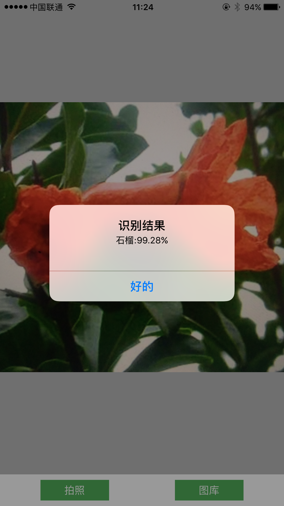
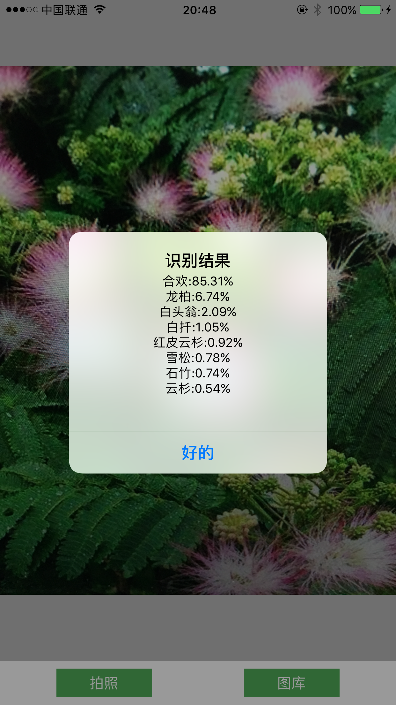

# 植物图片识别API
接收POST上传的图片，使用TensorFlow进行识别并返回结果

## 说明
1.参考TensorFlow官方文档([How to Retrain Inception's Final Layer for New Categories](https://www.tensorflow.org/versions/master/how_tos/image_retraining/index.html#training-steps))对识别图片进行训练，并将训练成果output_labels.txt和output_graph.pb拷贝到当前目录下。

2.之前实验结果表明，TensorFlow提供的Retrain Demo不支持分类标签是中文名称，所以可以按照dictionarys.txt的文档样式配置翻译字典

3.如果不需要翻译，则需要修改代码将翻译机制去掉

## 更新:
1.经测试由于IOS相机分辨率不高，可能会导致识别率没有安卓手机高([在图片中加入噪点就能骗过 Google 最顶尖的图像识别AI](https://www.oschina.net/news/84329/noise-can-fool-google-ai))，使用OpenCV对图片做高斯模糊处理，可以提高识别正确率

## TODO:
1.尝试其它模糊方案和模糊程度，寻找对于同一张图片识别率最高的模糊方法

2.使用其它模型进行训练，进一步提高识别率

## IOS客户端([PlantRecognitionByWebAPI](https://github.com/ConorPai/PlantRecognitionByWebAPI))调用截图:

